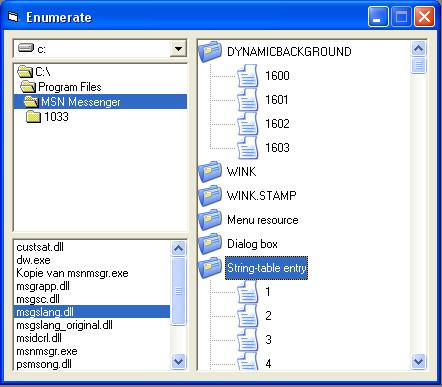



## Enumerate resource of a dll/exe

### Description

this code enumerates the resources of a dll/exe it find all the custom names and.. i hope you will vote for me cause i have been busy with this for i while
 
### More Info
 
a exe or a dll

the titles and the folders of the resources

             |
---                |---
**Submitted On**   |2006-05-20 15:10:02
**By**             |[Gh€ttoWarr\!or](https://github.com/Planet-Source-Code/PSCIndex/blob/master/ByAuthor/gh-ttowarr-or.md)
**Level**          |Advanced
**User Rating**    |5.0 (10 globes from 2 users)
**Compatibility**  |VB 4\.0 \(16\-bit\), VB 5\.0, VB 6\.0
**Category**       |[Windows API Call/ Explanation](https://github.com/Planet-Source-Code/PSCIndex/blob/master/ByCategory/windows-api-call-explanation__1-39.md)
**World**          |[Visual Basic](https://github.com/Planet-Source-Code/PSCIndex/blob/master/ByWorld/visual-basic.md)
**Archive File**   |[Enumerate\_1995665202006\.zip](https://github.com/Planet-Source-Code/gh-ttowarr-or-enumerate-resource-of-a-dll-exe__1-65424/archive/master.zip)

### API Declarations

a lot..

